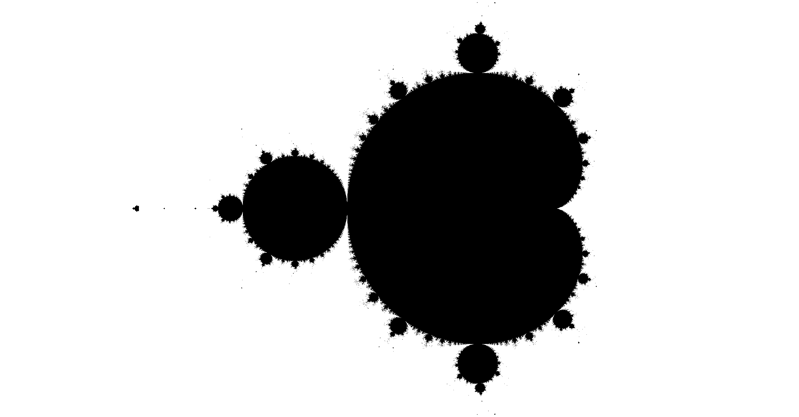
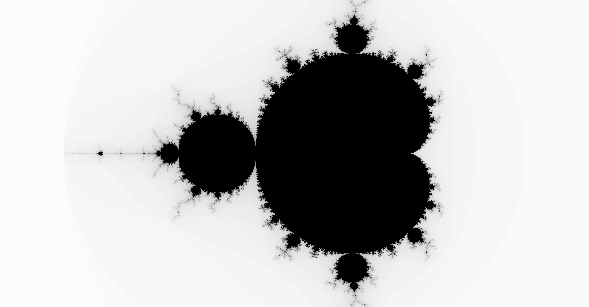
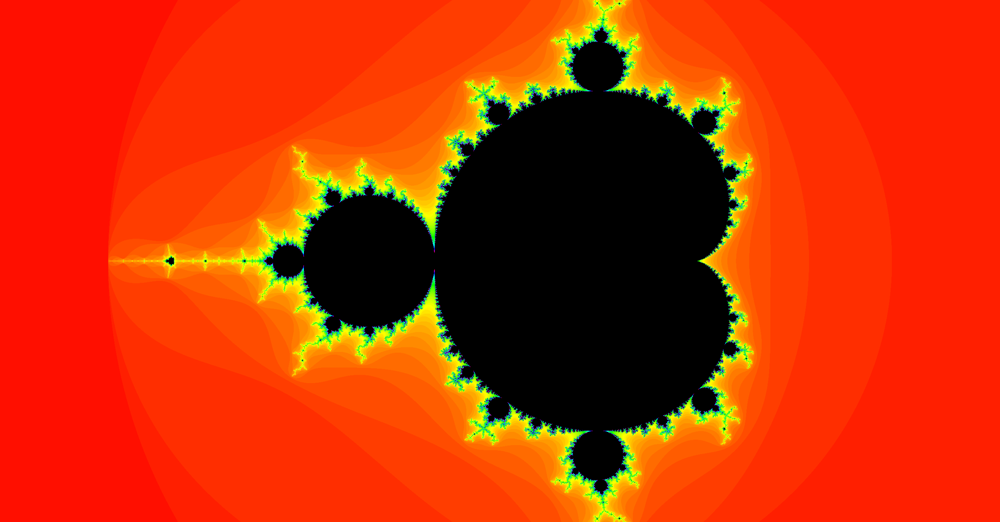

# Fractal Render

A WebGL Renderer for Fractal Equations.

## Introduction

This is my final project for the Computer Science class CS184: Computer Graphics at UC Berkeley. The class was focused on replicating the real-world on a display through different rendering techniques. This project will apply the learned concepts of rendering on mathematical fractal equations to visualize them on a display.

## Description

### What are fractals?

Fractals are a realative new field in mathematics to explain recurring patterns and chaos theory. A simple example of a fractal is a snowflake which was identified by Helge von Koch as a fractal.

This is the Koch snowflake, it started with a triangle, then after every iteration each side of the triangle got extended by another two lines, therefore creating 12 lines for the first iteration, and 48 lines for the next iteration, and so forth. 
The equation for the number of lines is: N(n) = 3 \* 4^n;
Very important to notice is that the area is convertent, meaning it is bounded, therefore the pattern gets finer, but keeps its shape. Also, if you zoom in onto a leaf of a snowflake, it resembles the overall shape of the snowflake, therefore the shape is created by combining unlimited snowflakes. This is what a fractal is. 
Here are some more examples of fractals:

### What are fractals good for?

Well, at the moment, the research does not really know what they are good for. They trying to connect it with the chaos theory by saying that fractals represent chaos, since we cannot understand both. In a Computer Graphics perspective fractals could be used to render different objects like brocolli, mountains, or landscape. 
Here is an example of a simulated landscape using fractals: 

Here is an animated example of creating a mountain landscape using fractals: 

Looks very realistic for a generated image, therefore using fractals could give use new ways go rener images.

### Goal

I am not trying to simulate landscapes or mountains using fractals, I am more interested in visualizing fractal equations since I think the power of fractals lies behind their mathematical represenation. Imagine, we could generate different objects just through equations, would not that idea be worth striving for? At the moment, we cannot formulate equations for fractals, it's the opposite, we find fractal equations and then visualize them without knowing how they gonna look, but this atleast allows us to write software to visualize fractals which we could potentially use in the future for the greater use-case. 
Here is the most famous visualization of a fractal equations, the Mandelbrot set: 

The goal of this project is to render 2D fractal equations like the Mandelbrot set using WebGL on the Browser.

## Implementation

### Decisions

Most fractals are described using Complex Numbers, therefore they are 2D. The theory behind it is very straightforward, you let a pixel be represented by a complex number, apply the fractal equations for that specific complex number, then check if and how fast it converges, and based on that determine the color this pixel will receive. This is a perfect case for OpenGL, but since the computation are very minimal, I will chose to use WebGL instead since this would allow the rendering be done on the browser which is more straightforward than downloading a program. Since the rendering will be interactive, I will use GSLS which is also supported by WebGL.  
Therefore the stack consists of WebGL and GSLS.

### The Coordinate System

We are starting with drawing a rectangle with 4 vertices, as shown in this image: 

Using the Fragment Shader we will get the position of all the pixels in between the rectangle:  

Now the crucial part is, assigning boundaries in the object space. We assign for the vertices in World Space different Values in Object Space. The bottom left is the smallest complex number in x and y direction, the top right is the biggest complex number in x and y direction.  

With all that information we can determine the complex number for each pixel which is: 
z = x _ (x1 - x0) / width + x0 + i _ (y \* (y1 - y0) / height + y0)

Now we can use this complex number for the pixel, iterate like 5000x the equations, check if it's converging using the threshold limit EPS which is very small, if it's converging therefore we can color the pixel accordingly. We can also incooperate the rate of converging, therefore creating darker and lighter color values to represent the rate of convergence.

## First Results

